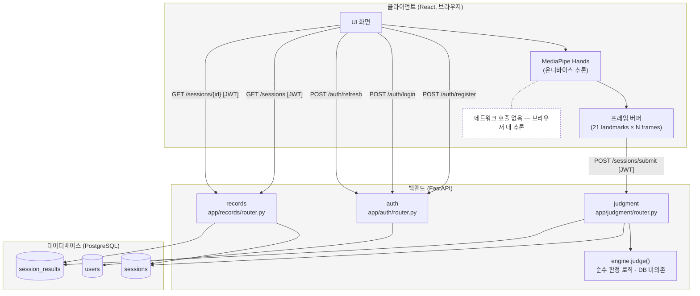
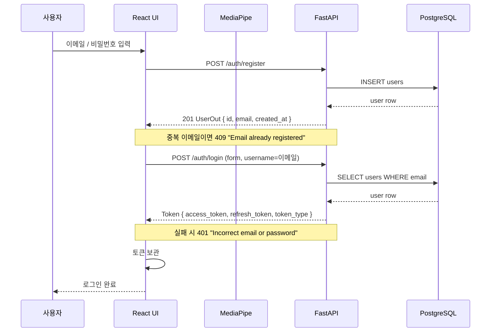
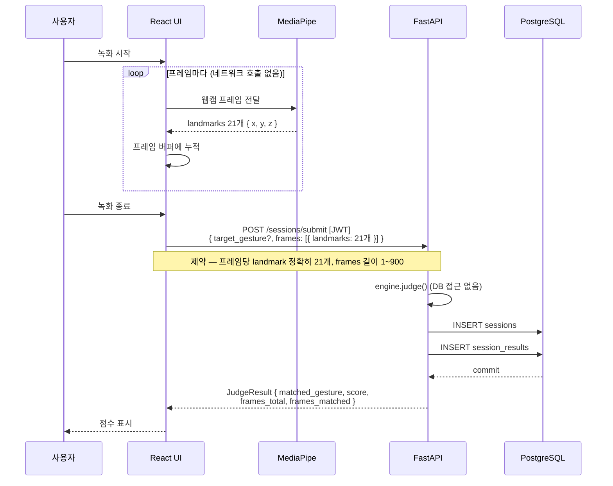
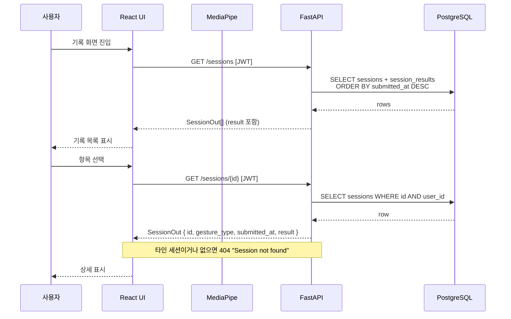

# 클라이언트·백엔드·추론 계층 API 시각화

Motion Recognition 서비스의 계층 간 API 호출 구조.

## 0. 읽는 법 (범례)

- **실선 화살표** — 요청 (HTTP 또는 SQL)
- **점선 화살표** — 응답
- **`[JWT]`** — `Authorization: Bearer <access_token>` 헤더 필요
- **회색 박스** — 프로세스 경계 (브라우저 / 서버 / DB)

## 1. 3계층 아키텍처 전체도



백엔드 → DB 화살표는 모두 async SQLAlchemy 2.0을 통한 SQL이다.

별도 AI 서버는 없다. MediaPipe Hands는 브라우저에서 온디바이스로 실행되므로
추론 단계에서 네트워크 호출이 발생하지 않는다.

## 2. 시나리오별 플로우

세 다이어그램 모두 participant를 같은 순서로 선언한다 (레인 위치 고정).

### 2.1 시나리오 1 — 가입 & 로그인



이후 모든 인증 요청에 `Authorization: Bearer <access_token>`을 부착한다.
access token 만료 시 `POST /auth/refresh`로 재발급받는다
(요청: `{ refresh_token }`, 응답: 새 `Token`).

### 2.2 시나리오 2 — 동작 인식 & 제출



### 2.3 시나리오 3 — 기록 조회



## 3. 보고서용 PNG 추출 방법

Node가 설치되어 있으면 한 줄로 변환된다. 저장소 루트에서:

```
npx -p @mermaid-js/mermaid-cli mmdc -i docs/architecture.md -o docs/architecture.png
```

Mermaid 블록 4개가 `docs/architecture-1.png` ~ `docs/architecture-4.png`로 각각 출력된다.

Node가 없는 환경에서는 수동으로 추출한다.

1. <https://mermaid.live> 에 코드 블록 붙여넣기 → Actions → PNG 다운로드
2. VSCode 확장 `Markdown Preview Mermaid Support` 설치 → 미리보기 → 화면 캡처
