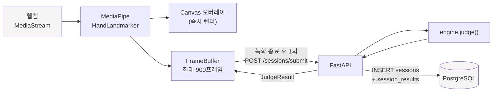
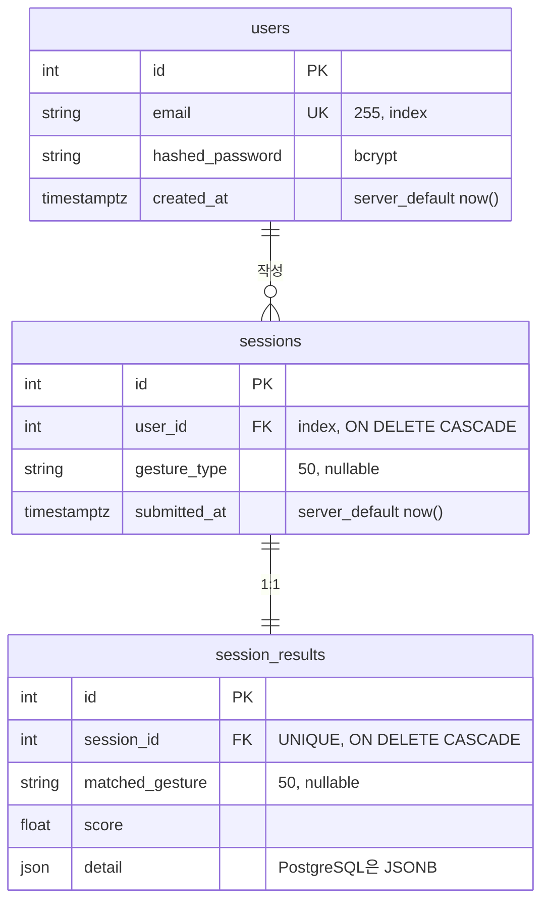

# 시스템 설계 문서

Motion Recognition 서비스의 계층 구성, API·DB 설계, 인증, 운영(로깅·장애·확장) 전략.

계층 간 호출 다이어그램은 [architecture.md](architecture.md)에 있다. 이 문서는 그 위에
설계 근거와 운영 계획을 얹는다.

## 0. 읽는 법 — 구현 상태 표시

이 문서는 **이미 동작하는 것**과 **아직 만들지 않은 것**을 섞어 쓰지 않는다.
모든 절은 다음 표시 중 하나를 단다.

| 표시 | 뜻 |
|------|-----|
| **[구현됨]** | 저장소 코드에 존재하고 실행·검증됨 |
| **[미구현 — 설계]** | 코드에 없음. 도입할 때의 방침 |
| **[알려진 한계]** | 현재 구현이 의도적으로 다루지 않는 것 |

과제 범위에서 실제로 만든 것은 1~5절이다. 6~8절(로깅·장애·확장)은 대부분 설계이며,
지금 무엇이 없는지를 명시하는 것이 이 문서의 목적 중 하나다.

---

## 1. 시스템 구성

### 1.1 계층 **[구현됨]**

| 계층 | 실체 | 기술 | 상태 |
|------|------|------|------|
| 클라이언트 | 브라우저 SPA | React 19 + TypeScript + Vite 6 | 무상태(토큰만 보관) |
| 추론 | **브라우저 내부** | MediaPipe Tasks Vision (WASM) | 서버 없음 |
| 백엔드 | 단일 FastAPI 프로세스 | FastAPI + async SQLAlchemy 2.0 | 무상태 |
| 데이터 | PostgreSQL 16 | Alembic 마이그레이션 | 유일한 상태 보관소 |

백엔드는 **모듈러 모놀리스**다. `auth` / `judgment` / `records` 세 모듈이 디렉터리와
라우터로 분리되어 있고, 배포 단위는 하나다.

### 1.2 AI 서버가 없는 이유 **[구현됨]**

과제 표현상 "AI 서버"에 해당하는 계층은 존재하지만 **프로세스로 분리되어 있지 않다.**
손 랜드마크 추출(MediaPipe)은 브라우저에서 WASM으로 실행된다.

이렇게 한 이유:

- **대역폭.** 영상을 서버로 보내면 프레임당 수십 KB다. 랜드마크만 보내면 프레임당
  21개 좌표 = 약 1KB다.
- **지연.** 실시간 오버레이(손 골격 표시)는 왕복 네트워크를 견디지 못한다. 온디바이스는
  프레임 단위로 즉시 처리된다.
- **개인정보.** 원본 영상이 단말을 떠나지 않는다. 서버는 좌표만 본다.
- **서버 비용.** GPU 추론 서버가 필요 없다.

대신 판정 로직(`app/judgment/engine.py`)은 서버에 둔다. 클라이언트가 점수를 계산하면
조작할 수 있기 때문이다. **추론은 클라이언트, 채점은 서버** 가 이 시스템의 신뢰 경계다.

### 1.3 AI 서버를 분리해야 하는 시점 **[미구현 — 설계]**

`engine.py`는 FastAPI·DB 임포트가 없는 순수 모듈이다. 이는 의도적이며, 아래 조건이
생기면 그대로 떼어내 별도 서비스로 만들 수 있다.

| 분리 트리거 | 그때 필요한 구조 |
|-------------|------------------|
| 학습 기반 모델(시퀀스 분류, DTW 등) 도입 — Python 프로세스에 무거운 의존성 유입 | 판정 서비스를 gRPC/HTTP로 분리, 백엔드는 호출만 |
| 판정이 CPU를 오래 점유해 API 응답을 막음 | 큐(예: Redis + 워커)로 비동기화, 세션은 `pending` 상태로 먼저 저장 |
| 저사양 단말 지원 — 서버 측 영상 추론 필요 | GPU 추론 서버 신설. 이때 비로소 "AI 서버"가 실제로 생김 |

현재 판정은 프레임당 부동소수 거리 계산 몇 번이다. 900프레임을 다 계산해도 밀리초
단위이므로 분리할 이유가 없다.

---

## 2. 데이터 흐름

### 2.1 전체 흐름 **[구현됨]**



핵심: **프레임은 스트리밍하지 않는다.** 녹화가 끝난 뒤 배치로 한 번 올린다.

### 2.2 왜 스트리밍이 아니라 배치인가 **[구현됨]**

| 항목 | 배치 제출 (채택) | WebSocket 스트리밍 |
|------|------------------|--------------------|
| 연결 관리 | 불필요 — 무상태 HTTP | 연결 상태를 서버가 보유 → 수평 확장 시 sticky 필요 |
| 재시도 | 버퍼가 클라이언트에 남아 있어 그대로 재전송 | 끊기면 유실 구간 협상 필요 |
| 채점 | 전체 시퀀스를 보고 한 번에 계산 | 부분 계산·누적 상태 필요 |
| 실시간 피드백 | 오버레이는 로컬에서 이미 제공 | 서버 왕복 지연 발생 |

실시간 서버 피드백이 요구사항에 없으므로 배치가 단순하고 강하다.

### 2.3 페이로드 크기 **[구현됨]**

- 프레임당 랜드마크 **정확히 21개**, 각 `{x, y, z}` 부동소수.
- JSON 직렬화 기준 프레임당 약 1KB.
- 상한 `MAX_FRAMES = 900` (30fps 기준 약 30초) → **최대 약 1MB**.

상한은 서버(`app/judgment/schemas.py`)와 클라이언트(`src/hands/frameBuffer.ts`) 양쪽에
동일한 상수로 존재한다. 클라이언트는 900프레임에 닿으면 녹화를 자동 종료하고,
서버는 초과 요청을 422로 거부한다. **클라이언트 제한은 UX, 서버 제한은 방어다.**

---

## 3. API 구조

### 3.1 엔드포인트 **[구현됨]**

| Method | Path | 인증 | 성공 | 주요 실패 |
|--------|------|------|------|-----------|
| GET | `/health` | - | 200 `{"status":"ok"}` | - |
| POST | `/auth/register` | - | 201 `UserOut` | 409 이메일 중복 / 422 검증 |
| POST | `/auth/login` | - | 200 `Token` | 401 자격 불일치 |
| POST | `/auth/refresh` | - | 200 `Token` | 401 토큰 무효 |
| POST | `/sessions/submit` | JWT | 200 `JudgeResult` | 401 / 422 프레임 검증 |
| GET | `/sessions` | JWT | 200 `SessionOut[]` | 401 |
| GET | `/sessions/{session_id}` | JWT | 200 `SessionOut` | 401 / 404 |

`/docs`에 OpenAPI 문서가 자동 생성된다.

### 3.2 설계 규약 **[구현됨]**

- **리소스 중심 경로.** `/sessions`가 컬렉션, `/sessions/{id}`가 개별 항목이다.
  `/sessions/submit`만 동사인데, 이는 "세션 생성 + 판정"이라는 부수효과를 가진
  명령이라 일반 POST와 구분했다.
- **인증은 표준 OAuth2 password flow.** `/auth/login`은 JSON이 아니라 form-encoded이며
  필드명이 `username`이다(값은 이메일). Swagger의 Authorize 버튼이 그대로 동작한다.
- **에러 본문은 FastAPI 기본 형식으로 통일.**
  ```json
  { "detail": "Email already registered" }
  ```
  검증 오류(422)만 `detail`이 배열이다. 클라이언트(`api/client.ts`)는 문자열이 아니면
  직렬화해 표시한다.
- **응답 스키마는 Pydantic으로 고정.** ORM 객체를 그대로 반환하지 않으므로
  `hashed_password` 같은 필드가 새어 나갈 수 없다.

### 3.3 주요 스키마 **[구현됨]**

```jsonc
// POST /sessions/submit 요청
{
  "target_gesture": "open_palm",        // 생략 가능
  "frames": [                            // 1 ~ 900개
    { "landmarks": [ {"x":0.1,"y":0.2,"z":0.0}, /* ... 정확히 21개 ... */ ] }
  ]
}

// 응답
{
  "matched_gesture": "open_palm",
  "score": 96.4,                         // 0~100, 소수 1자리
  "frames_total": 83,
  "frames_matched": 80
}
```

`target_gesture`가 있으면 **그 제스처와 일치한 프레임 비율**이 점수다. 없으면 가장 많이
인식된 제스처를 그 자신의 비율과 함께 보고한다.

지원 제스처는 `app/judgment/gestures.py`의 5종:
`open_palm`, `fist`, `thumbs_up`, `peace`, `pointing`.

### 3.4 판정 엔진 **[구현됨]**

손가락 펴짐 여부를 5비트 패턴 `(thumb, index, middle, ring, pinky)`으로 만들고
제스처 테이블과 완전 일치를 본다.

- **검지~새끼**: 끝점(tip)이 PIP 관절보다 손목에서 멀면 펴진 것. 거리만 쓰므로 손의
  회전·좌우손 구분에 영향받지 않는다.
- **엄지**: 손목 기준을 쓸 수 없다. 엄지는 손목 쪽으로 말리는 게 아니라 손바닥을 가로질러
  접히기 때문에, 접어도 손목과의 거리가 멀어 항상 "펴짐"으로 읽힌다. 그래서 **새끼손가락
  MCP를 기준점**으로 삼는다. 접으면 tip이 새끼 쪽으로 다가오고, 펴면 멀어진다.

> 이 엄지 기준점은 실제 손으로 검증하다 발견해 수정한 부분이다. 합성 좌표 기반 단위
> 테스트는 전부 통과하고 있었지만, `fist`와 `peace`가 실기기에서 0점이 나왔다.
> 원인은 엄지 짝을 `(tip=4, 2)`로 잡은 것 — 랜드마크 2는 PIP가 아니라 손목 옆의 MCP다.

`engine.judge()`는 DB에 접근하지 않는 순수 함수다. 같은 입력이면 항상 같은 점수가 나오고,
DB 장애와 무관하게 동작하며, 단위 테스트가 쉽다.

---

## 4. 데이터베이스 설계

### 4.1 ERD **[구현됨]**



### 4.2 설계 판단 **[구현됨]**

**시각은 DB가 찍는다.** `created_at` / `submitted_at`은 `server_default=func.now()`로
PostgreSQL이 생성한다. 애플리케이션 서버를 여러 대로 늘려도 시계가 어긋나지 않고,
타임존을 포함(`timestamptz`)해 저장한다.

**`detail`은 JSONB.** `frames_total`, `frames_matched` 같은 판정 부산물이 들어간다.
판정 알고리즘이 바뀌면 담을 항목도 바뀌는데, 그때마다 마이그레이션을 하지 않기 위해
스키마리스로 뒀다. 반대로 **점수(`score`)와 인식 제스처는 정식 컬럼**이다 — 정렬·집계·
통계의 대상이기 때문이다. *"조회 조건이 되는 값은 컬럼, 부산물은 JSON"* 이 기준이다.

이식성을 위해 `JSON().with_variant(JSONB, "postgresql")`로 선언했다. PostgreSQL에서는
JSONB, 테스트용 SQLite에서는 일반 JSON으로 동작한다.

**삭제는 계단식.** `users` 삭제 시 `sessions`, `sessions` 삭제 시 `session_results`가
DB 레벨 `ON DELETE CASCADE`로 함께 지워진다. ORM `cascade` 설정에만 의존하면 직접 SQL을
날렸을 때 고아 행이 남는다.

**1:1을 별도 테이블로 분리한 이유.** `session_results`는 `session_id`에 UNIQUE가 걸려
있어 사실상 1:1이다. 합칠 수도 있었지만 분리했다 — 판정 재실행(같은 세션 재채점)이나
판정 이력 보관으로 확장할 때 `sessions`를 건드리지 않기 위해서다.

**인덱스.** `users.email`(UNIQUE), `sessions.user_id`. 목록 조회가 항상
`WHERE user_id = ?`로 시작하므로 이 인덱스가 핵심이다.

**N+1 회피.** 목록 조회는 `selectinload(Session.result)`로 결과를 한 번에 가져온다.

### 4.3 저장하지 않는 것 **[알려진 한계]**

원시 랜드마크 시퀀스는 **저장하지 않는다.** 세션당 최대 1MB이고, 현재는 재채점 기능이
없어 보관할 이유가 없다. 판정 알고리즘 개선 시 과거 데이터로 회귀 검증을 하려면 그때
객체 스토리지(S3 등)에 넣고 DB에는 키만 두는 방식이 맞다. RDB에 넣을 데이터는 아니다.

### 4.4 스키마 관리 **[구현됨]**

Alembic. 현재 리비전은 `37f813bb334e_init` 하나이며 모델에서 autogenerate했다.

```powershell
alembic revision --autogenerate -m "설명"
alembic upgrade head
```

---

## 5. 인증 / 권한

### 5.1 인증 방식 **[구현됨]**

JWT 이중 토큰. 비밀번호는 bcrypt 해시(솔트 자동)로 저장한다.

| 토큰 | 수명(기본) | 용도 |
|------|-----------|------|
| access | 30분 | 모든 보호 API 호출 |
| refresh | 7일 | access 재발급 전용 |

클레임:

```json
{ "sub": "42", "iat": 1753660800, "exp": 1753662600, "type": "access" }
```

`type` 클레임이 핵심이다. refresh 토큰을 API 호출에 쓰거나 access 토큰으로 재발급을
시도하면 거부된다. 이게 없으면 수명 긴 refresh 토큰이 사실상 무제한 access 토큰이 된다.

### 5.2 검증 순서 **[구현됨]**

`get_current_user` (`app/auth/deps.py`):

1. `Authorization: Bearer <token>` 추출 — 없으면 401
2. 서명·만료 검증 (HS256) — 실패 시 401
3. `type == "access"` 확인 — 아니면 401
4. `sub`로 사용자 조회 — 없으면 401 (삭제된 사용자의 유효 토큰 차단)

실패는 전부 동일한 401 `"Could not validate credentials"`다. 어느 단계에서 걸렸는지
알려주지 않는다.

### 5.3 권한 모델 **[구현됨]**

역할(role)이 없다. 규칙 하나뿐이다: **모든 세션 데이터는 소유자만 접근한다.**

강제 방식은 애플리케이션 레벨 필터다. 조회 쿼리에 항상 `user_id`가 들어간다.

```python
select(Session).where(Session.id == session_id, Session.user_id == user.id)
```

**타인의 세션에는 403이 아니라 404를 반환한다.** 403은 "존재하지만 권한 없음"을
알려주므로, ID를 훑어 다른 사용자의 세션 개수와 ID 범위를 알아낼 수 있다. 404는
"없음"과 "남의 것"을 구분해 주지 않는다.

### 5.4 비밀 관리 **[구현됨]**

`JWT_SECRET`에는 **기본값이 없다.** 없으면 앱이 기동하지 못하고 즉시 죽는다.
기본값을 두면 배포 환경에서 공개된 키로 토큰이 서명될 수 있고, 그건 인증이 없는 것과
같다. `.env`는 gitignore되어 있고 `.env.example`이 템플릿이다.

### 5.5 알려진 한계 **[알려진 한계]**

과제 범위상 넣지 않은 것들. 운영에 올린다면 아래는 순서대로 필요하다.

| 항목 | 현재 | 위험 | 대응 |
|------|------|------|------|
| refresh 토큰 무효화 | 없음 (stateless) | 유출된 refresh 토큰이 7일간 유효 | jti + 폐기 목록(Redis), 재발급 시 회전 |
| 서버 측 로그아웃 | 없음 | 클라이언트가 토큰을 버릴 뿐 | 위와 동일 인프라로 해결 |
| 로그인 레이트리밋 | 없음 | 무차별 대입 가능 | IP·계정 단위 제한, 실패 시 지연 |
| 이메일 인증 | 없음 | 아무 주소로 가입 가능 | 인증 메일 + `verified` 플래그 |
| 비밀번호 정책 | 8~72자 길이만 | 약한 비밀번호 통과 | 유출 목록 대조 |
| 토큰 보관 위치 | 클라이언트 저장소 | XSS 시 탈취 | httpOnly 쿠키 + CSRF 토큰 |

> 72자 상한은 임의값이 아니다. bcrypt가 72바이트를 넘는 입력을 잘라내므로, 그 이상은
> 검증 단계에서 거부하는 편이 정직하다.

---

## 6. 로깅 / 모니터링 **[미구현 — 설계]**

**현재 상태: 애플리케이션 로깅이 없다.** `app/` 전체에 logger 호출이 0건이며,
uvicorn의 기본 액세스 로그만 표준 출력으로 나간다. 메트릭·추적·알림 모두 없다.

아래는 도입 시의 방침이다.

### 6.1 로그 형식

JSON 구조적 로깅, 표준 출력으로만 출력한다(파일 회전은 컨테이너 런타임에 맡긴다).

```json
{
  "ts": "2026-07-28T10:15:00Z",
  "level": "INFO",
  "request_id": "01J...",
  "user_id": 42,
  "method": "POST",
  "path": "/sessions/submit",
  "status": 200,
  "duration_ms": 34,
  "frames_total": 83,
  "score": 96.4
}
```

`request_id`는 미들웨어에서 발급하고 응답 헤더 `X-Request-ID`로 돌려준다. 사용자가
신고한 실패 건을 로그에서 바로 찾기 위해서다.

### 6.2 절대 남기지 않을 것

- 비밀번호(평문·해시 모두)
- 토큰 전문 — 필요하면 `sub`와 `jti`만
- **랜드마크 좌표 전체** — 생체 정보에 가깝고 양이 크다. 개수와 통계만 남긴다
- 이메일 전문 — 사용자 식별은 `user_id`로 한다

### 6.3 수집할 지표

| 분류 | 지표 |
|------|------|
| 트래픽 | 엔드포인트별 RPS, 상태 코드 분포 |
| 지연 | p50 / p95 / p99. `/sessions/submit`은 판정 시간과 DB 시간을 분리 |
| 오류 | 5xx 비율, 401 급증(공격 징후), 422 급증(클라이언트 회귀 징후) |
| DB | 커넥션 풀 사용률·대기 시간, 느린 쿼리 |
| 도메인 | 제스처별 평균 점수, 인식 실패(`matched_gesture=null`) 비율 |

마지막 줄이 이 서비스에서 가장 중요하다. **특정 제스처의 평균 점수가 갑자기 떨어지면
판정 엔진 회귀 신호다.** 이번 엄지 버그는 서버가 500을 내지 않았고 지연도 정상이었다.
인프라 지표만 봤다면 절대 못 잡는다.

### 6.4 헬스체크

현재 `/health`는 항상 `{"status":"ok"}`를 반환한다 — DB를 확인하지 않으므로
**liveness 용도로만 유효하다.**

readiness는 별도로 두는 것이 맞다.

- `/health` (liveness) — 프로세스 생존. 지금 그대로
- `/health/ready` (readiness) — `SELECT 1`로 DB 연결 확인. 실패 시 503

둘을 합치면 DB가 잠깐 흔들릴 때 오케스트레이터가 멀쩡한 프로세스를 재시작해 상황을
악화시킨다.

---

## 7. 장애 대응

### 7.1 실패 지점별 현황

| 지점 | 원인 | 현재 동작 | 상태 |
|------|------|-----------|------|
| `JWT_SECRET` 누락 | 환경변수 미설정 | **기동 실패, 즉시 중단** | **[구현됨]** — 의도된 동작 |
| 잘못된 페이로드 | 랜드마크 21개 아님, 900프레임 초과 | 422 + 항목별 사유 | **[구현됨]** |
| 만료 토큰 | access 30분 경과 | 401 → 클라이언트가 로그아웃 처리 | **[구현됨]** |
| 타인 세션 접근 | ID 추측 | 404 | **[구현됨]** |
| 카메라 거부/부재 | 권한 거부, HTTPS 아님 | 원인별 한국어 안내 | **[구현됨]** |
| 모델 로드 실패 | WASM/모델 파일 없음 | 화면에 오류 표시, 녹화 버튼 비활성 | **[구현됨]** |
| 서버 연결 불가 | 백엔드 다운 | `ApiError(0, "서버에 연결할 수 없습니다.")` | **[구현됨]** |
| DB 다운 | PostgreSQL 중단 | **500 + 스택트레이스가 로그로만** | **[알려진 한계]** |
| 커밋 실패 | 제약 위반, 연결 끊김 | 세션 종료 시 암묵적 롤백 | **[알려진 한계]** — 명시적 롤백 없음 |
| 재시도 폭주 | 클라이언트 반복 제출 | 제한 없음 | **[미구현]** |

### 7.2 데이터 정합성 **[구현됨]**

`/sessions/submit`은 `Session`과 `SessionResult`를 **한 트랜잭션에서 커밋한다.**
ORM 관계로 묶어 `db.add(session)` 한 번으로 처리하므로, "세션은 있는데 결과가 없는"
중간 상태가 생기지 않는다.

판정은 DB 접근 **이전에** 끝난다. DB가 죽으면 저장에 실패할 뿐 채점이 절반만 되는 일은
없다.

### 7.3 보완 방침 **[미구현 — 설계]**

**전역 예외 핸들러.** 처리되지 않은 예외를 잡아 `request_id`와 함께 로깅하고,
클라이언트에는 내부 정보 없는 500을 반환한다. 지금은 FastAPI 기본 동작에 맡기고 있다.

**명시적 롤백.** `get_db`에 `try/except`를 두고 예외 시 `await session.rollback()`을
호출한다. 현재도 세션 종료 시 롤백되지만, 의도가 코드에 드러나지 않는다.

**클라이언트 재시도.** 제출 실패 시 버퍼가 살아 있으므로 재전송이 가능하다. 다만 지금은
사용자가 직접 버튼을 다시 눌러야 한다. 5xx·네트워크 오류에 한해 지수 백오프 자동 재시도를
넣을 수 있다. **401·422는 재시도하면 안 된다** — 반복해도 결과가 같다.

**레이트리밋.** `/auth/login`(무차별 대입 방어)과 `/sessions/submit`(1MB 페이로드 남용
방어)에 필요하다.

**백업.** PostgreSQL 일 단위 `pg_dump` + WAL 아카이빙. 복구 절차를 실제로 한 번
수행해 확인해야 한다. 검증하지 않은 백업은 백업이 아니다.

### 7.4 저하 모드

DB 장애 시 서비스를 통째로 죽일 필요는 없다. 판정 엔진은 DB와 무관하므로,
**점수는 계산해 응답하고 저장만 실패했음을 알리는** 저하 모드가 가능하다. 사용자는
연습을 계속할 수 있고 기록만 남지 않는다. 다만 "저장됨"과 "저장 안 됨"을 응답에서
명확히 구분해야 한다. **[미구현 — 설계]**

---

## 8. 확장성 전략

### 8.1 현재 규모 **[구현됨]**

단일 프로세스 + 단일 DB. 과제·시연 규모에서는 충분하며, 조기 최적화를 하지 않았다.

이미 확장에 유리한 성질:

- **API가 무상태다.** JWT 검증에 서버 저장소가 필요 없다. 세션 스토어도, sticky 세션도
  없으므로 **프로세스를 늘리는 것만으로 수평 확장된다.**
- **추론이 클라이언트에 있다.** 사용자가 늘어도 서버 CPU가 그만큼 늘지 않는다.
  가장 무거운 연산이 이미 분산되어 있다.
- **판정이 순수 함수다.** 어디서 실행하든 결과가 같아 옮기기 쉽다.
- **I/O가 비동기다.** async SQLAlchemy + asyncpg라 DB 대기 중 다른 요청을 처리한다.

### 8.2 병목 예상 순서 **[미구현 — 설계]**

부하가 커질 때 실제로 먼저 터질 순서:

1. **DB 커넥션 풀** — 가장 먼저 온다. API 프로세스를 늘릴수록 커넥션이 배로 늘어난다.
   → PgBouncer 같은 커넥션 풀러를 앞에 둔다.
2. **`/sessions` 목록 조회** — 사용자당 세션이 쌓이면 전체 조회가 무거워진다.
   → 커서 기반 페이지네이션. `(user_id, submitted_at DESC)` 복합 인덱스.
3. **제출 페이로드 대역폭** — 동시 제출이 많으면 1MB × N.
   → gzip 요청 압축, 프레임 다운샘플링(30fps → 10fps로도 판정에 지장 없음).
4. **판정 CPU** — 알고리즘이 무거워진 뒤에야 온다.
   → 큐 + 워커로 비동기화 (1.3절).

### 8.3 단계별 로드맵 **[미구현 — 설계]**

| 단계 | 트리거 | 조치 |
|------|--------|------|
| 0 (현재) | — | 단일 프로세스 + 단일 DB |
| 1 | 배포 재현성 필요 | docker-compose (api + postgres), uvicorn 워커 다중화 |
| 2 | 단일 인스턴스 한계 | 로드밸런서 + API 다중 인스턴스. **코드 변경 불필요 — 이미 무상태** |
| 3 | 커넥션·읽기 부하 | PgBouncer, 읽기 복제본으로 조회 분리 |
| 4 | 판정 비용 증가 | 판정 워커 분리, 세션 `pending` 상태 도입 |
| 5 | 데이터 누적 | 오래된 세션 아카이빙, 원시 랜드마크는 객체 스토리지 |

**단계 2에 코드 변경이 필요 없다는 점이 이 설계의 핵심 이점이다.** 무상태 인증과
클라이언트 측 추론을 처음부터 선택한 대가로 얻은 것이다.

### 8.4 하지 않기로 한 것 **[구현됨 — 의도적 배제]**

- **캐시 계층(Redis 등).** 조회는 전부 사용자별 개인 데이터라 캐시 적중률이 낮다.
  refresh 토큰 폐기 목록이 필요해지는 시점에 함께 도입하는 것이 맞다.
- **마이크로서비스 분해.** 모듈 경계는 이미 디렉터리로 분리되어 있다. 필요할 때 떼어내면
  된다. 지금 나누면 운영 복잡도만 늘어난다.
- **GraphQL.** 엔드포인트가 7개이고 클라이언트가 하나다. REST로 충분하다.

---

## 9. 미구현 항목 요약

운영 배포 전 반드시 필요한 것을 우선순위 순으로 정리한다.

| 우선순위 | 항목 | 절 |
|----------|------|-----|
| 1 | HTTPS 적용 (`getUserMedia` 필수 요건이기도 함) | 5.5 |
| 2 | 구조적 로깅 + `request_id` | 6.1 |
| 3 | 전역 예외 핸들러 (내부 정보 노출 차단) | 7.3 |
| 4 | `/auth/login` 레이트리밋 | 5.5 |
| 5 | readiness 헬스체크 분리 | 6.4 |
| 6 | refresh 토큰 회전·폐기 | 5.5 |
| 7 | `/sessions` 페이지네이션 | 8.2 |
| 8 | DB 백업 + 복구 절차 검증 | 7.3 |
| 9 | docker-compose | 8.3 |

---

## 관련 문서

- [architecture.md](architecture.md) — 계층 간 API 호출 다이어그램, 시나리오별 시퀀스
- [../backend/README.md](../backend/README.md) — 설치·실행·마이그레이션
- [../frontend/README.md](../frontend/README.md) — 클라이언트 실행
- `/docs` (서버 기동 시) — OpenAPI 자동 문서
